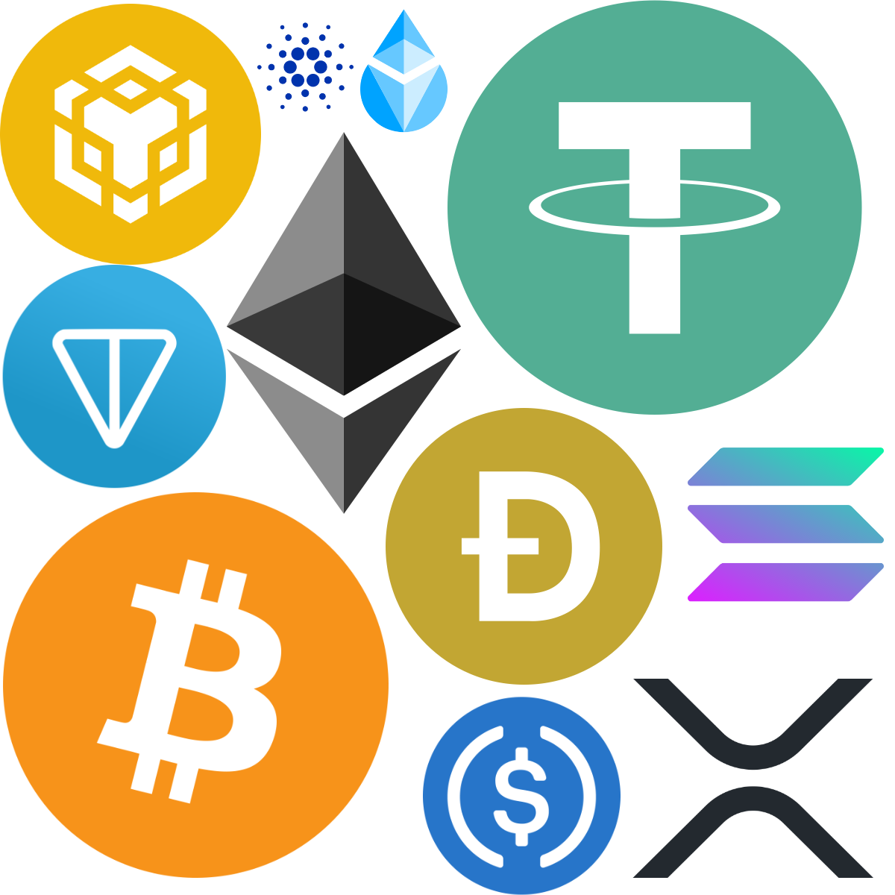
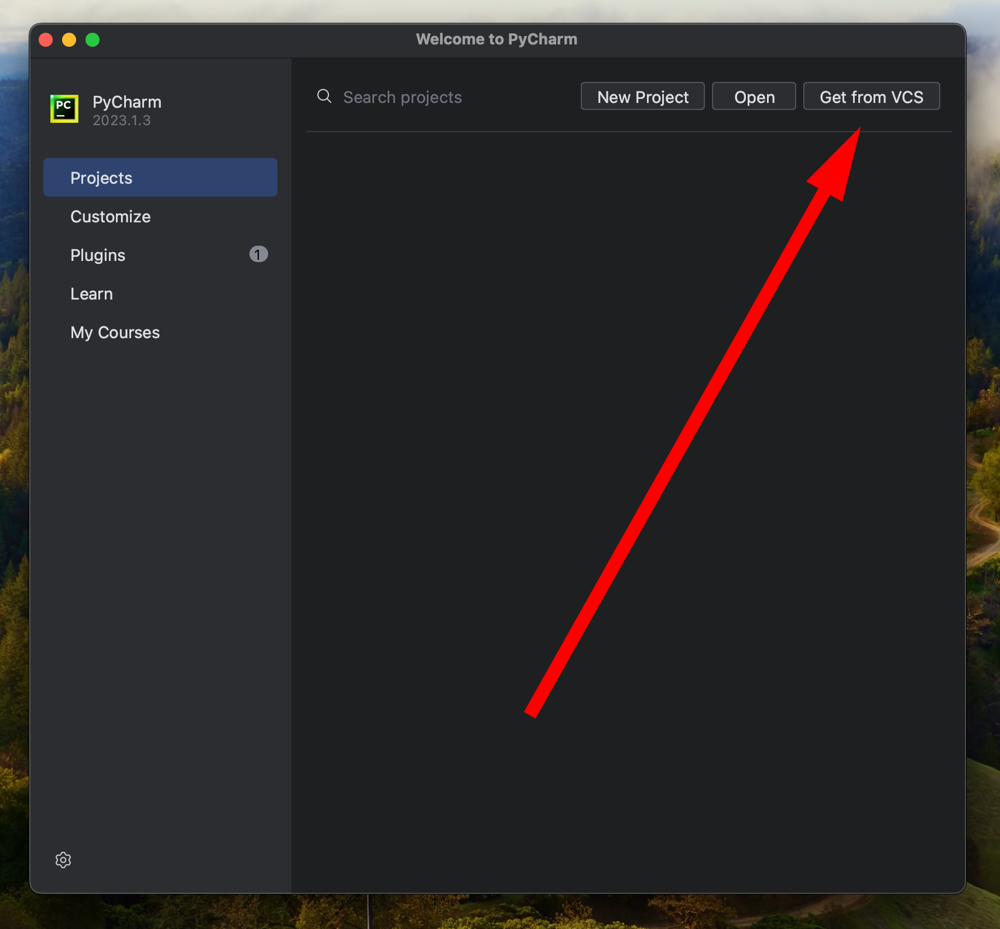
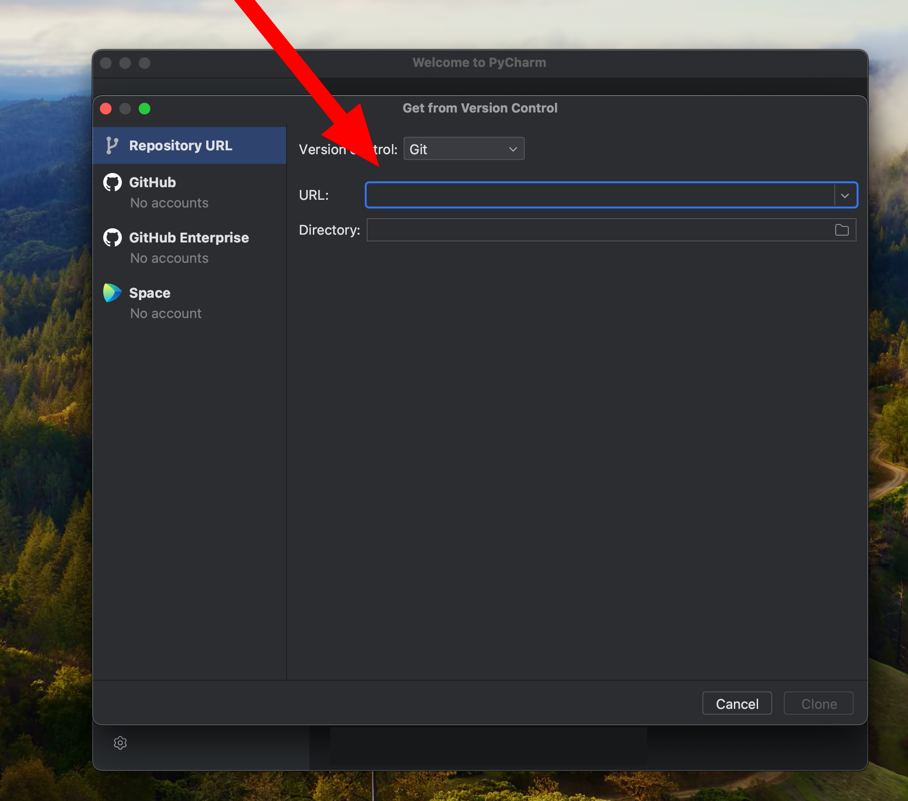
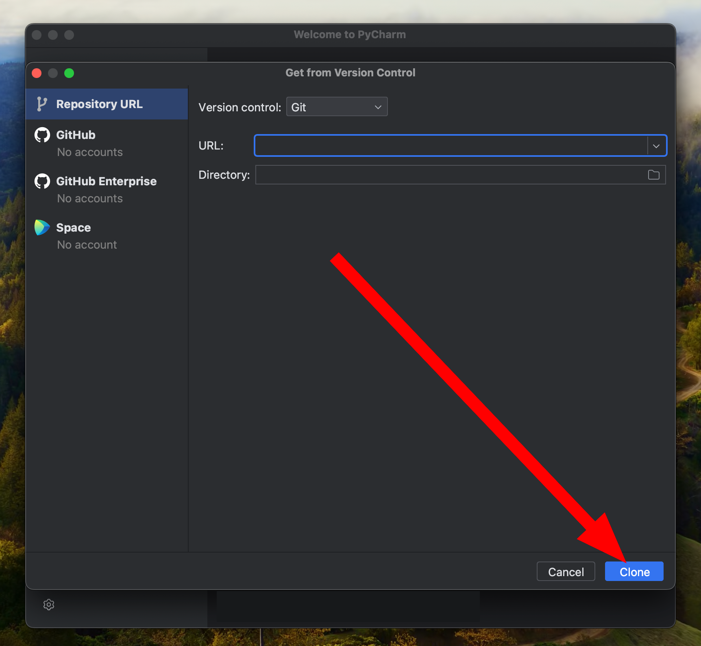
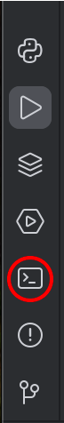
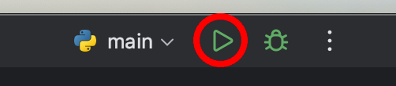

# БОТ ДЛЯ ОТСЛЕЖИВАНИЯ КУРСА КРИПТОВАЛЮТ


---

### Как пользоваться

<br>
После нажатия на кнопку "START" бот отправит сообщение-приветствие, где описано, как использовать бот.

<br>

---

#### Custom command:

**/price** — Получить текущую цену криптовалюты.

CURL POST: [Url](https://api.coingecko.com/api/v3/simple/price?ids={}&vs_currencies=usd&x_cg_demo_api_key={})
```json
{
  "bitcoin": {
    "usd": 67187.33589365664,
    "usd_market_cap": 1317802988326.2493,
    "usd_24h_vol": 31260929299.52484,
    "usd_24h_change": 3.637278946773539,
    "last_updated_at": 1711356300
  }
}
```
**/top_exchanges** — Получить список топ 10 криптобирж

CURL POST: [Url]("https://api.coingecko.com/api/v3/exchanges?per_page=100&x_cg_demo_api_key={}")
```json
{
    "id": "binance",
    "name": "Binance",
    "year_established": 2017,
    "country": "Cayman Islands",
    "description": "",
    "url": "https://www.binance.com/",
    "image": "https://coin-images.coingecko.com/markets/images/52/small/binance.jpg?1706864274",
    "has_trading_incentive": false,
    "trust_score": 10,
    "trust_score_rank": 1,
    "trade_volume_24h_btc": 254569.00073148997,
    "trade_volume_24h_btc_normalized": 142861.4012172517
  }
```


**/info** — Получить информацию о криптовалюте.

CURL POST: [Url]("https://api.coingecko.com/api/v3/coins/{}?developer_data=true&x_cg_demo_api_key={}")
```json
{
  "symbol": "btc",
  "name": "Bitcoin",
  "block_time_in_minutes": 10,
  "description": {
    "en": "Bitcoin is the first successful internet money based on peer-to-peer technology; whereby no central bank or authority is involved in the transaction and production of the Bitcoin currency. It was created by an anonymous individual/group under the name, Satoshi Nakamoto. The source code is available publicly as an open source project, anybody can look at it and be part of the developmental process.\r\n\r\nBitcoin is changing the way we see money as we speak. The idea was to produce a means of exchange, independent of any central authority, that could be transferred electronically in a secure, verifiable and immutable way. It is a decentralized peer-to-peer internet currency making mobile payment easy, very low transaction fees, protects your identity, and it works anywhere all the time with no central authority and banks.\r\n\r\nBitcoin is designed to have only 21 million BTC ever created, thus making it a deflationary currency. Bitcoin uses the <a href=\"https://www.coingecko.com/en?hashing_algorithm=SHA-256\">SHA-256</a> hashing algorithm with an average transaction confirmation time of 10 minutes. Miners today are mining Bitcoin using ASIC chip dedicated to only mining Bitcoin, and the hash rate has shot up to peta hashes.\r\n\r\nBeing the first successful online cryptography currency, Bitcoin has inspired other alternative currencies such as <a href=\"https://www.coingecko.com/en/coins/litecoin\">Litecoin</a>, <a href=\"https://www.coingecko.com/en/coins/peercoin\">Peercoin</a>, <a href=\"https://www.coingecko.com/en/coins/primecoin\">Primecoin</a>, and so on.\r\n\r\nThe cryptocurrency then took off with the innovation of the turing-complete smart contract by <a href=\"https://www.coingecko.com/en/coins/ethereum\">Ethereum</a> which led to the development of other amazing projects such as <a href=\"https://www.coingecko.com/en/coins/eos\">EOS</a>, <a href=\"https://www.coingecko.com/en/coins/tron\">Tron</a>, and even crypto-collectibles such as <a href=\"https://www.coingecko.com/buzz/ethereum-still-king-dapps-cryptokitties-need-1-billion-on-eos\">CryptoKitties</a>."
  },
  "links": {
    "homepage": [
      "http://www.bitcoin.org",
      "",
      ""
    ],
    "blockchain_site": [
      "https://mempool.space/",
      "https://blockchair.com/bitcoin/",
      "https://btc.com/",
      "https://btc.tokenview.io/",
      "https://www.oklink.com/btc",
      "https://3xpl.com/bitcoin",
      "",
      "",
      "",
      ""
    ],
    "official_forum_url": [
      "https://bitcointalk.org/"
    ],
    "twitter_screen_name": "bitcoin",
    "facebook_username": "bitcoins"
  },
  "image": {
    "thumb": "https://coin-images.coingecko.com/coins/images/1/thumb/bitcoin.png?1696501400"
  },
  "market_cap_rank": 1
}
```

**/top** — Получить список топ-10 криптовалют.

CURL POST: [Url](https://api.coingecko.com/api/v3/coins/markets?vs_currency=usd&order=market_cap_desc&x_cg_demo_api_key={})


| Информация                              |
|-----------------------------------------|
| Логотип                                 |
| Название монеты                         |
| Текущая цена монеты в валюте            |
| Рейтинг монет по рыночной капитализации |
| Рыночная капитализация монет в валюте   |
| Общий объем торгов монетами в валюте    |

```json
[
  {
    "id": "bitcoin",
    "symbol": "btc",
    "name": "Bitcoin",
    "image": "https://coin-images.coingecko.com/coins/images/1/large/bitcoin.png?1696501400",
    "current_price": 62977,
    "market_cap": 1243498773795,
    "market_cap_rank": 1,
    "fully_diluted_valuation": 1323253130321,
    "total_volume": 38008791269,
    "high_24h": 66595,
    "low_24h": 62304,
    "price_change_24h": -3235.010120630199,
    "price_change_percentage_24h": -4.88586,
    "market_cap_change_24h": -62047736938.83472,
    "market_cap_change_percentage_24h": -4.75263,
    "circulating_supply": 19734300,
    "total_supply": 21000000,
    "max_supply": 21000000,
    "ath": 73738,
    "ath_change_percentage": -14.28099,
    "ath_date": "2024-03-14T07:10:36.635Z",
    "atl": 67.81,
    "atl_change_percentage": 93113.9262,
    "atl_date": "2013-07-06T00:00:00.000Z",
    "roi": null,
    "last_updated": "2024-08-01T18:28:32.193Z"
  },
  {
    "id": "ethereum",
    "symbol": "eth",
    "name": "Ethereum",
    "image": "https://coin-images.coingecko.com/coins/images/279/large/ethereum.png?1696501628",
    "current_price": 3099.65,
    "market_cap": 372667570843,
    "market_cap_rank": 2,
    "fully_diluted_valuation": 372667570843,
    "total_volume": 21023723759,
    "high_24h": 3317.2,
    "low_24h": 3085.38,
    "price_change_24h": -193.8063639363868,
    "price_change_percentage_24h": -5.88459,
    "market_cap_change_24h": -22156876045.03772,
    "market_cap_change_percentage_24h": -5.61183,
    "circulating_supply": 120251313.934882,
    "total_supply": 120251313.934882,
    "max_supply": null,
    "ath": 4878.26,
    "ath_change_percentage": -36.29548,
    "ath_date": "2021-11-10T14:24:19.604Z",
    "atl": 0.432979,
    "atl_change_percentage": 717642.31228,
    "atl_date": "2015-10-20T00:00:00.000Z",
    "roi": {
      "times": 64.77635224384477,
      "currency": "btc",
      "percentage": 6477.635224384478
    },
    "last_updated": "2024-08-01T18:28:32.645Z"
  },
  {
    "id": "tether",
    "symbol": "usdt",
    "name": "Tether",
    "image": "https://coin-images.coingecko.com/coins/images/325/large/Tether.png?1696501661",
    "current_price": 0.999562,
    "market_cap": 114445354714,
    "market_cap_rank": 3,
    "fully_diluted_valuation": 114445354714,
    "total_volume": 50377561728,
    "high_24h": 1.002,
    "low_24h": 0.995938,
    "price_change_24h": 0.00020494,
    "price_change_percentage_24h": 0.02051,
    "market_cap_change_24h": 52805840,
    "market_cap_change_percentage_24h": 0.04616,
    "circulating_supply": 114495496586.556,
    "total_supply": 114495496586.556,
    "max_supply": null,
    "ath": 1.32,
    "ath_change_percentage": -24.50384,
    "ath_date": "2018-07-24T00:00:00.000Z",
    "atl": 0.572521,
    "atl_change_percentage": 74.47153,
    "atl_date": "2015-03-02T00:00:00.000Z",
    "roi": null,
    "last_updated": "2024-08-01T18:25:42.681Z"
  }
]
```

**/history** — Просмотреть историю запросов о криптовалютах.


---

#### Default command:
**/start** - старт

**/help** - помощь, как использовать.

---

### Как запустить
Скачайте `PyCharm` и нажмите `Get from VCS` или откройте терминал



Введите `https://gitlab.skillbox.ru/dmitrii_shanin/python_basic_diploma.git` или `git clone https://gitlab.skillbox.ru/dmitrii_shanin/python_basic_diploma.git`, если вы решили использовать терминал




Откройте Терминал в `PyCharm` и введите `pip install -r requirements.txt`

Если вы используете терминал вне `PyCharm` введите `pip install -r requirements.txt`



В папке `config_data` находится файл `.env.template`. Скопируйте содержимое этого файла, создайте файл `.env`, вставьте туда скопированный код и замените `ТОКЕН_ИЗ_BotFather` на токен вашего бота, а `ТОКЕН_ИЗ_CoinGecko` на ваш API Key из CoinGecko.

После чего в PyCharm нажмите на зеленый треугольник или в окно терминала введите `python3 main.py`


